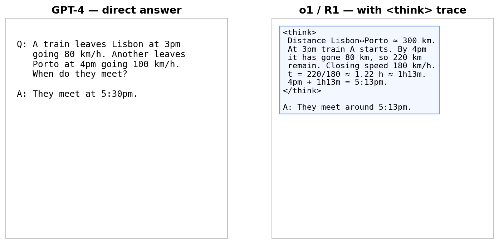
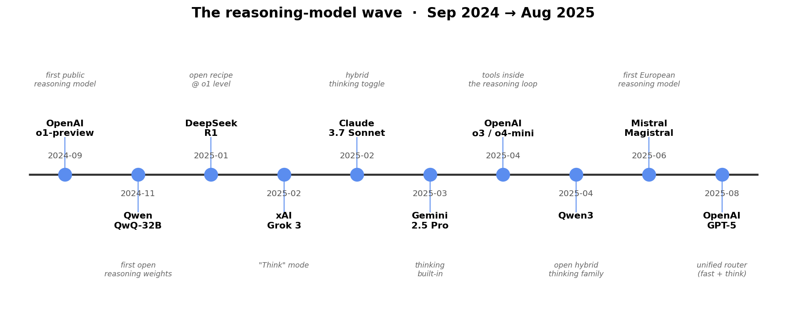
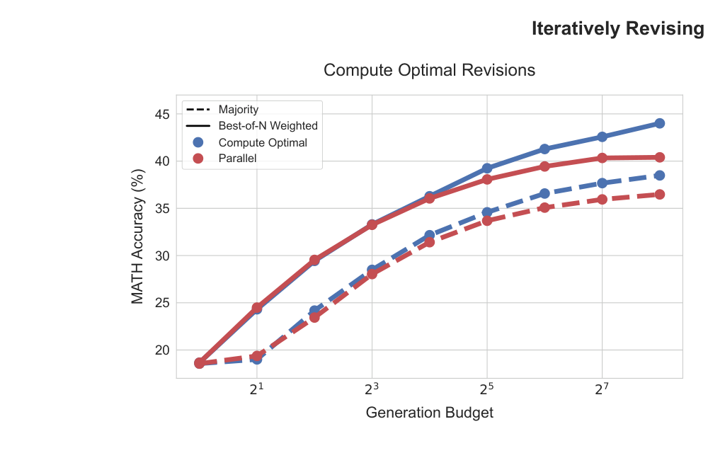
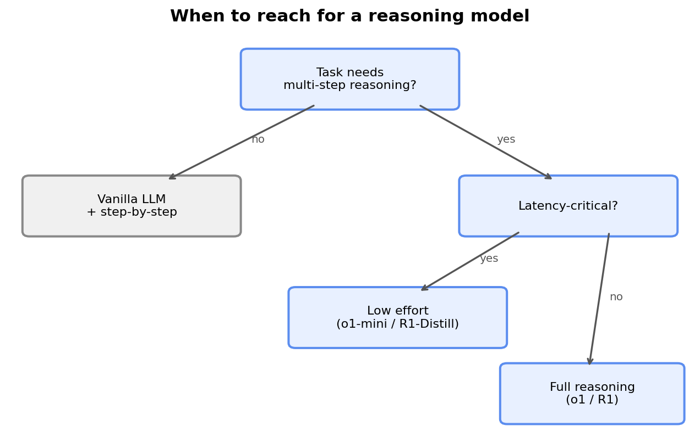

# Reasoning LLMs
### Module 1 — What are they, why now?

Lucas Soares · O'Reilly Live Training

---

## What is "reasoning"?

> Multi-step problem solving — not retrieval.

---

## Vanilla LLM weak spots

- Knowledge cutoffs
- No actions in the world
- Long-horizon planning collapses

---

## Direct answer vs. thinking chain



---

## Timeline



---

## Test-time compute scaling



> More thinking → more accuracy.

---

## The simplest trick

```text
Q: A train leaves at 3pm…
A: Let's think step by step.
```

---

## When to reach for a reasoning model



Math · code · planning · multi-constraint puzzles.

---

## Cost & latency

> 5–50× more tokens. Use only when the task needs it.

---

## Reasoning effort knobs

- **OpenAI:** `reasoning_effort = none / low / medium / high`
- **Anthropic:** `thinking.budget_tokens = N`

---

## Live demo →

`notebooks/01_chain_of_thought_intuition.ipynb`

GPT-2 with and without "Let's think step by step"

---

## Recap

- Reasoning ≠ retrieval
- Trade tokens for accuracy
- Next: how DeepSeek **trained** a reasoning model
