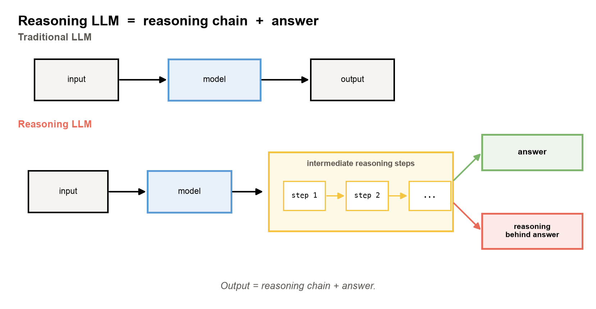
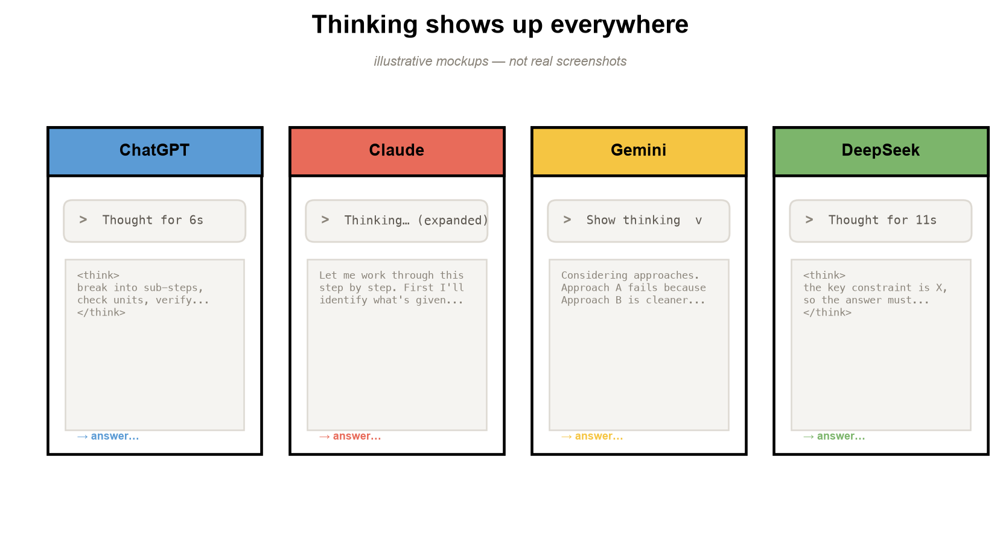
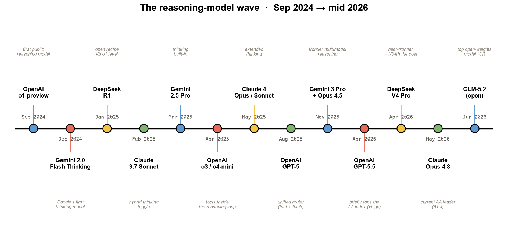
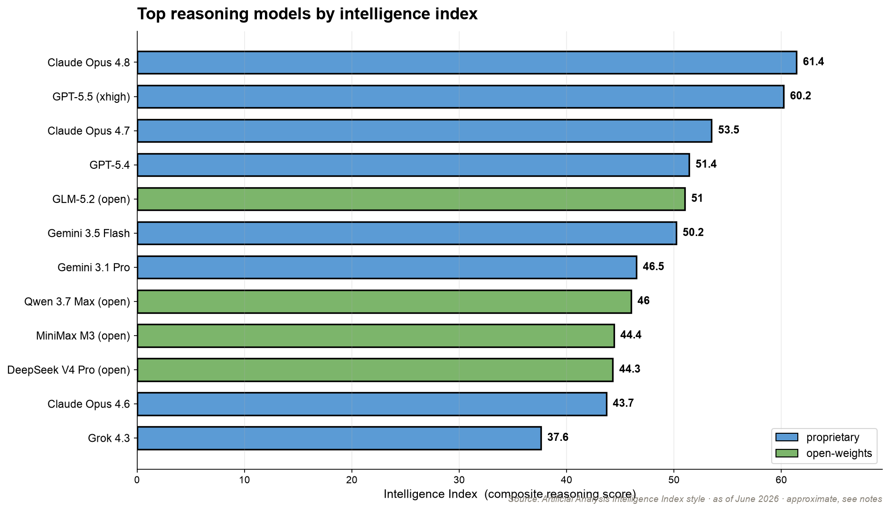
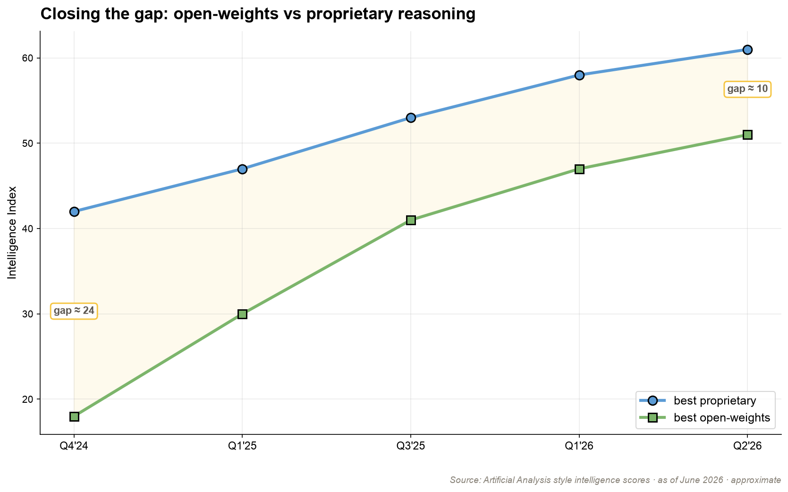
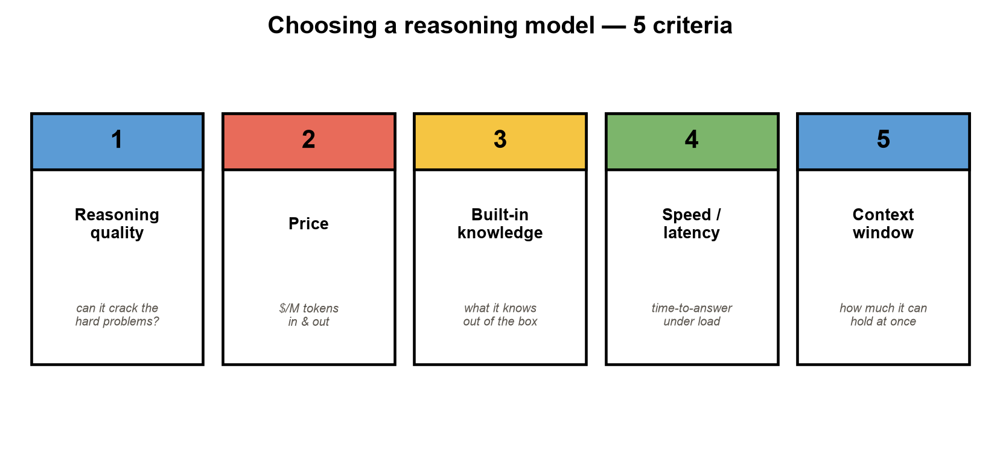
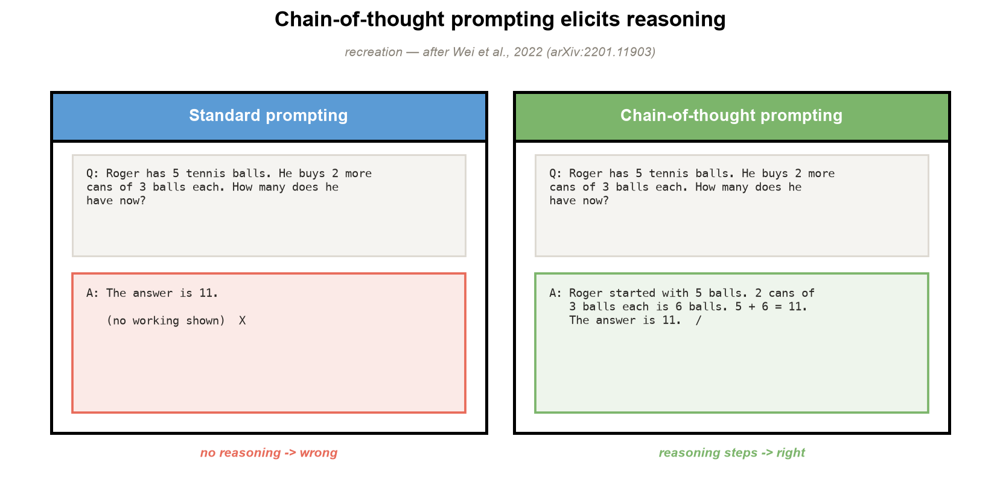
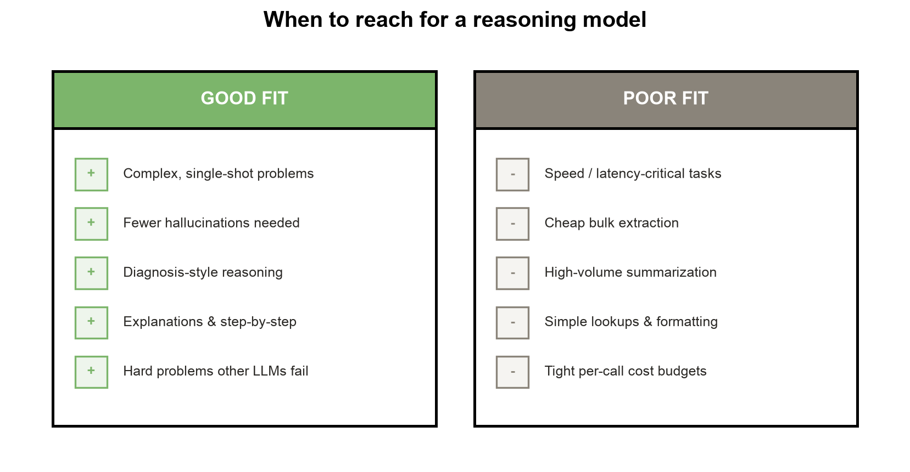
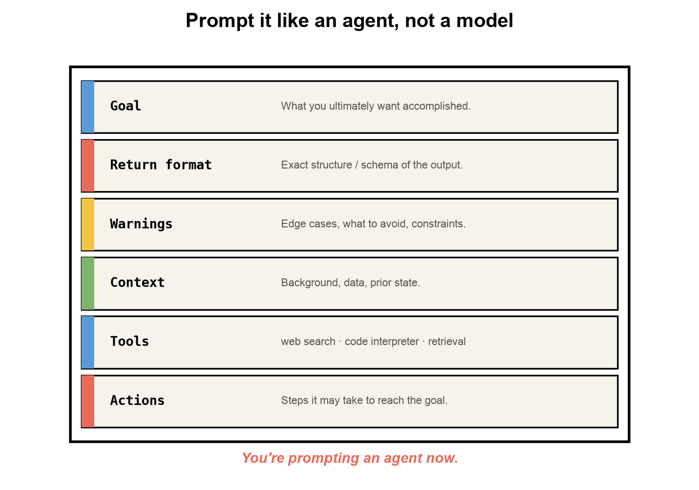

<!--
SPEAKER NOTES (deck-wide):
This deck is visual-first. Most slides are one image + one line — you narrate the rest.
The arc follows the course whiteboard storyboard:
what is reasoning → seeing it in the wild → where models rank → why/when to use → how to prompt → limits.
Assets live in presentation/assets/. Swap `thinking_in_the_wild.png` for real product
screenshots if you have them.
-->

# Reasoning LLMs
### Module 1 — What they are, why now

Lucas Soares · O'Reilly Live Training

---

## What do we mean by "reasoning"?

**Recall** — look something up:
> "What's the course code for Stanford's Transformers class?" → CME 295

**Reasoning** — work it out:
> "A bear was born in 2020. How old in 2025?" → 2025 − 2020 = **5**

Reasoning = solving a problem through a **multi-step process**, not a single lookup.

<!-- Source framing: Stanford CME295 Fall 2025, Lecture 6. No agreed formal definition — this is the working one. -->

---

## What is a reasoning LLM?

> The output contract changes: **Output = reasoning chain + answer.**

---

## You've already seen these everywhere

> The **"Thinking…"** tag is the tell — ChatGPT, Claude, Gemini, DeepSeek all show it.

<!-- Like the Stanford lecture's montage: thought summaries / <think> traces all over modern UIs.
     Drop in your own real screenshots here if you'd like. -->

---

## A catch: you pay for the thoughts

Reasoning tokens are **billed as output tokens** — on every major API.

- UIs show a *summarized* thought, not the raw chain
  (barely-readable, and exposed chains could train rivals)
- So there's a real incentive to get **the most reasoning per token**

> More on controlling the thinking budget later.

---

## How we got here

> o1-preview kicked it off (Sep 2024). DeepSeek-R1 (Jan 2025) made the **recipe public**.

---

## Where the models rank today

> Demand concentrates on a handful of top labs. *(Artificial Analysis, ~June 2026.)*

---

## Closing the gap

> Open-weights reasoning models now trail the frontier by **months, not years**.

---

## Why reach for a reasoning model?

It earns its extra tokens when the task is a **derivation**, not a lookup:

- Decomposes hard, multi-constraint problems
- Hallucinates less on problems it can *check itself* on
- Gives you the **reasoning**, not just the verdict

---

## What actually matters when you pick one

> Reasoning quality · price · built-in knowledge · speed · context window.

---

## Price is the other axis

| Model (~June 2026) | $/M out | |
|---|---|---|
| GPT-5.5 | ~$30 | frontier |
| Claude Opus 4.8 | ~$25 | frontier |
| Gemini 3.1 Pro | ~$12 | |
| **DeepSeek V4 Pro** | **~$0.87** | near-frontier, **~34× cheaper** |

> The expensive model isn't always the right call. *(Approx; we test this in notebook 08.)*

---

## Why does thinking longer help?

> Every generated token is another forward pass — reasoning tokens **buy compute** before the model commits.

---

## The simplest version of the trick

> "Let's think step by step." Chain-of-thought, scaled up, *is* the core idea. *(after Wei et al., 2022)*

---

## Two reasons a reasoning chain helps

1. **Decomposition** — break a problem the model has never seen into sub-problems it *has*.
2. **More compute** — more tokens before the answer = more computation spent on it.

> Extended chains and self-correction ("wait, that's wrong…") **emerge from RL**, not just from prompting.

---

## When to use one — and when not to

> Great for hard, single-shot problems. Wasteful for cheap, high-volume extraction.

---

## How to prompt a reasoning model

- Keep the prompt **short and direct** — don't hand-write the chain of thought for it
- Frame it as an **expert generalist**; state the goal, not the steps
- Give it **clear success/failure criteria** for what a good answer looks like
- Tune **effort/budget** to the task instead of always maxing it

<!-- Over-prompting CoT can hurt models already trained to reason. See OpenAI/Anthropic prompting guides. -->

---

## You're not prompting a model — you're prompting an agent

> Goal · return format · context · tools · actions. Modern reasoning systems route and act.

---

## The effort knobs

- **OpenAI:** `reasoning.effort = none / low / medium / high / xhigh`
- **Anthropic:** `thinking.budget_tokens = N` (or adaptive)
- **Google:** thinking config on the Gemini models

> Same model, dial the depth to the task.

---

## Limitations (keep them honest)

- 5–50× more tokens → **cost & latency**
- Early/open models: **language mixing**, sensitivity to few-shot
- The visible "thought" is a summary — and **may not be faithful**
  *(Anthropic: "reasoning models don't always say what they think")*

---

## Live demo →

`notebooks/01_foundations_reasoning_and_cot.ipynb`

A tiny model learns that **a scratchpad beats answering directly** — the whole idea, measured, on your laptop.

---

## Recap

- Reasoning ≠ retrieval — **output = reasoning + answer**
- You can *see* it (the "Thinking…" tag) and you *pay* for it
- Trade tokens for accuracy — only when the task needs it
- Next: how DeepSeek **trained** one, then we **rebuild** it in code
