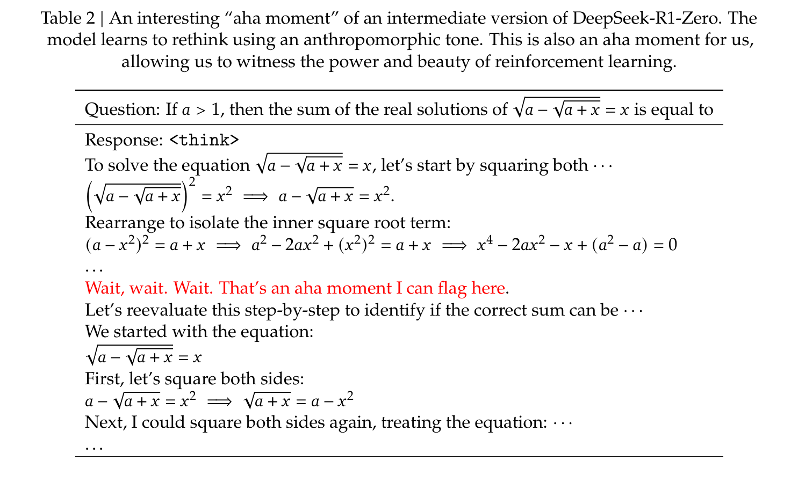
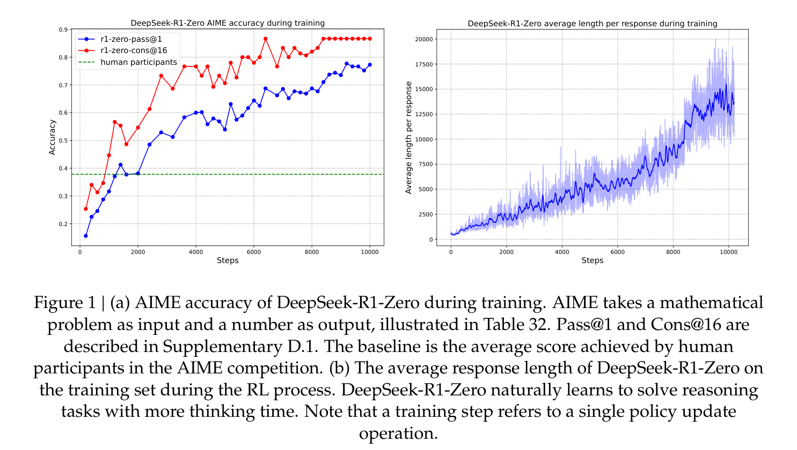
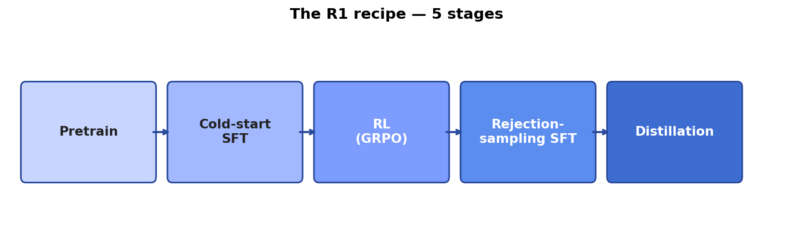
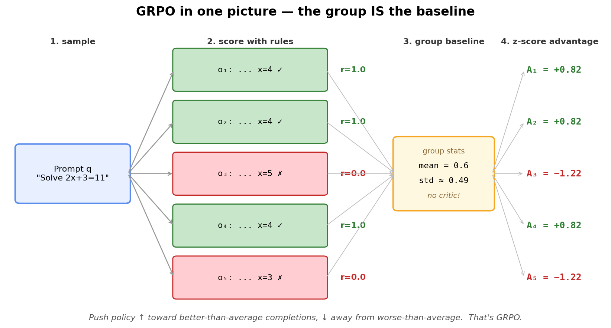
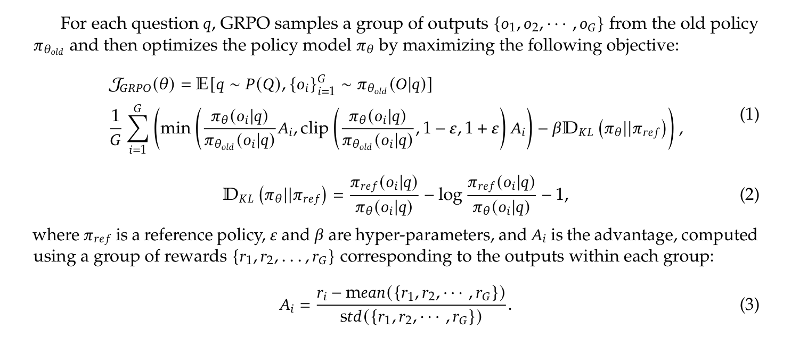
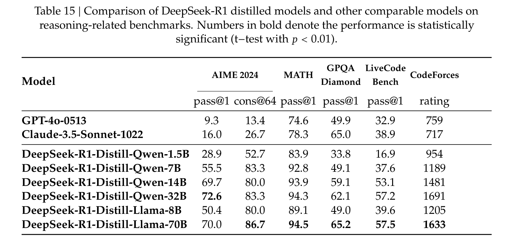

# DeepSeek R1
### Module 2 — Reading the paper

arxiv.org/pdf/2501.12948

---

## Why this paper matters

> Open weights + an open recipe for o1-level reasoning.

---

## R1-Zero vs R1

- **R1-Zero:** pure RL on a base model, no SFT. Works — but ugly outputs.
- **R1:** add a small cold-start SFT + a second SFT pass. Same skill, readable.

---

## The "aha moment"

<!-- Cropped from DeepSeek R1 paper (arxiv 2501.12948), Table 2 -->

---

## Accuracy curve

<!-- Cropped from DeepSeek R1 paper (arxiv 2501.12948), Figure 1 -->

---

## The 5-stage recipe

---

## GRPO — the 30-second intuition

1. Ask the model the **same question G times** (e.g. G = 16)
2. **Score** each answer with simple rules (right? well-formatted?)
3. Each answer's **advantage** = how much better than the group average
4. Nudge the policy ↑ on better-than-average, ↓ on worse-than-average

> No value net. No human rater. The **group is the baseline**.

---

## Why no critic?

| | **PPO** (classic RL) | **GRPO** (DeepSeek) |
|---|---|---|
| Baseline | learned value model (extra NN) | mean reward of the group |
| Networks trained | policy + value | policy only |
| Memory footprint | ~2× | ~1× |
| Reward source | learned reward model (usually) | **rule-based** (correct? formatted?) |

Half the moving parts. No reward hacking from a learned critic.

---

## GRPO in one picture

*One prompt → G rollouts → rule-based rewards → z-score advantages.*

---

## The formal objective

<!-- Cropped from DeepSeek R1 paper (arxiv 2501.12948), §2.2.1 eqs (1)–(3) -->

> Clipped PPO-style update — but the advantage `Â` is just the **z-score of the group rewards**. That's the whole trick.

---

## Reward design

- **Accuracy reward** — does the final answer match?
- **Format reward** — did it use `<think>...</think>`?

No learned reward model. Rule-based only.

---

## Distillation results

<!-- Cropped from DeepSeek R1 paper (arxiv 2501.12948), Table 15 -->

---

## Limitations

> Language mixing, sensitivity to few-shot, weaker on general chat.

---

## Next →

We rebuild every stage in code.

`presentation/03-r1-recipe-five-stages.md`
